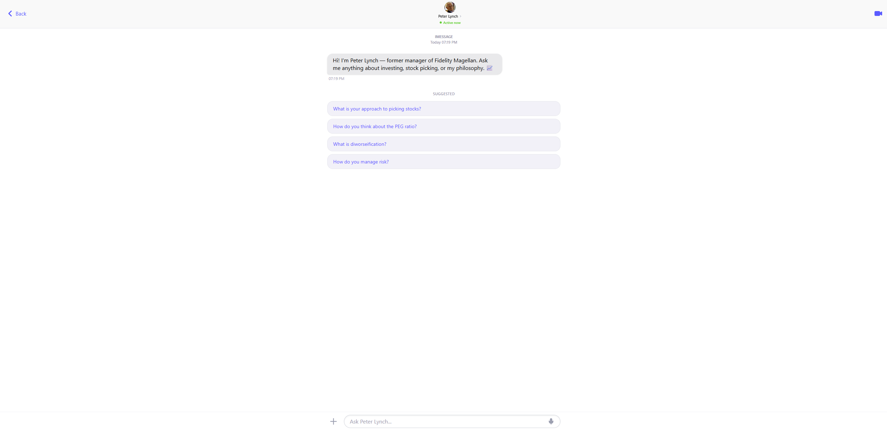

🧠 TraderMind

A full-stack AI chatbot that lets you have a real conversation with a legendary investor's philosophy — powered by RAG, Llama 3.1, and an iMessage-style interface.

📌 Overview
TraderMind is a domain-specific conversational AI built on Retrieval-Augmented Generation (RAG). It answers questions about investment philosophy in first person, drawing from a hand-crafted knowledge base of 900+ Q&A pairs.
Instead of relying on a general-purpose LLM that might hallucinate, every response is grounded in verified, curated content — making answers accurate, relevant, and on-brand.
The frontend is built to feel like a native iMessage conversation, making the experience intuitive and engaging.

✨ Features

💬 iMessage-style chat UI — blue/gray bubbles, typing indicator, animations
🧠 RAG pipeline — semantic search over 900+ Q&A pairs before every response
⚡ Sub-second responses — Llama 3.1 served via Groq inference API
🗂️ Persistent vector store — ChromaDB saved to disk, no re-indexing on restart
🔁 Conversation memory — last 3 turns sent to the LLM for context
📱 Responsive design — works on mobile and desktop

🏗️ Architecture
Browser (React + TypeScript)
        │
        │  POST /chat  { question, history }
        ▼
FastAPI Backend (Python)
        │
        ├── ChromaDB  →  semantic search over 900+ Q&A chunks
        │                (paraphrase-MiniLM-L6-v2 embeddings)
        │
        └── Groq API  →  Llama 3.1 (8B) generates the answer
                         grounded in retrieved context

🛠️ Tech Stack
LayerTechnologyFrontendReact 18, TypeScript, Vite, Tailwind CSSAnimationsFramer MotionBackendFastAPI, Python 3.11LLMLlama 3.1-8B via Groq APIEmbeddingsparaphrase-MiniLM-L6-v2 (HuggingFace)Vector DBChromaDB (persistent)RAG FrameworkLangChainKnowledge Base900+ hand-crafted Q&A pairs

📁 Project Structure
TraderMind/
├── start.bat                 # Run both servers with one click
│
├── backend/
│   ├── api.py                # FastAPI server
│   ├── lynch_bot.py          # RAG pipeline
│   ├── requirements.txt      # Python dependencies
│   ├── .env.example          # Environment variables template
│   └── data/
│       └── Lynch.csv         # 900+ Q&A knowledge base
│
└── frontend/
    ├── src/
    │   ├── App.tsx            # iMessage chat UI
    │   └── api.ts             # Backend API calls
    ├── public/
    │   └── PL.jpeg            # Contact avatar
    ├── .env.example           # Environment variables template
    └── package.json

🚀 Getting Started
Prerequisites

Python 3.11
Node.js 18+
Groq API key (free at console.groq.com)

1. Clone the repo
cd tradermind
2. Set up backend
bashcd backend
py -3.11 -m venv venv
venv\Scripts\activate
pip install -r requirements.txt
Create backend/.env:
GROQ_API_KEY=your_groq_api_key_here
3. Set up frontend
bashcd frontend
npm install
Create frontend/.env:
VITE_API_URL=http://localhost:8000
4. Run both servers
bash# From root folder — double click or run:
.\start.bat
5. Open in browser
http://localhost:5173

💬 Example Conversations
You:   Who are you?
Bot:   I'm Peter Lynch — former manager of Fidelity's Magellan Fund
       from 1977 to 1990. I turned $18 million into $14 billion with
       a 29.2% average annual return...

You:   What is the PEG ratio?
Bot:   The PEG ratio is calculated as PE divided by the earnings
       growth rate plus dividend yield. I considered a PEG below 1
       attractive, around 1 fair, and above 2 expensive...

You:   What is diworseification?
Bot:   Diworseification is what I call it when companies make
       overpriced, unrelated acquisitions instead of returning
       cash to shareholders through buybacks or dividends...

🧠 Knowledge Base
900 hand-crafted Q&A pairs organized across 6 investment domains:
LabelTopics# PairsPersonal LifeWork ethic, habits, mindset150Strategy DevelopmentStock classification, PEG ratio, portfolio design150TimingEntry/exit signals, cycle analysis150Risk ManagementBalance sheet analysis, position sizing150AdaptabilityAdjusting strategy across market conditions150PsychologyEmotional discipline, contrarian thinking150